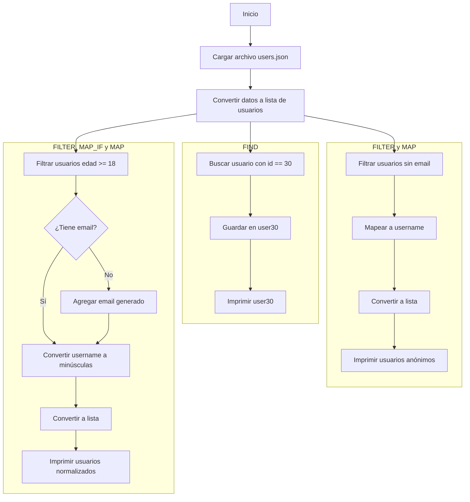

```mermaid
flowchart TD
    A[Inicio] 
    B[Cargar archivo users.json]
    C[Convertir datos a lista de usuarios]
    A --> B
    B --> C

    %% FIND
    subgraph FIND
        D[Buscar usuario con id == 30]
        D --> E[Guardar en user30]
        E --> F[Imprimir user30]
    end

    C --> D

    %% FILTER y MAP (anónimos)
    subgraph "FILTER y MAP"
        G[Filtrar usuarios sin email]
        G --> H[Mapear a username]
        H --> I[Convertir a lista]
        I --> J[Imprimir usuarios anónimos]
    end

    C --> G

    %% FILTER, MAP_IF y MAP (normalización)
    subgraph "FILTER, MAP_IF y MAP"
        K[Filtrar usuarios edad >= 18]
        K --> L{¿Tiene email?}

        L -- No --> M[Agregar email generado]
        L -- Sí --> O

        M --> O[Convertir username a minúsculas]

        O --> P[Convertir a lista]
        P --> Q[Imprimir usuarios normalizados]
    end

    C --> K
```